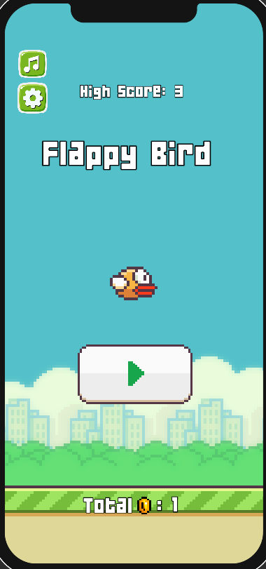
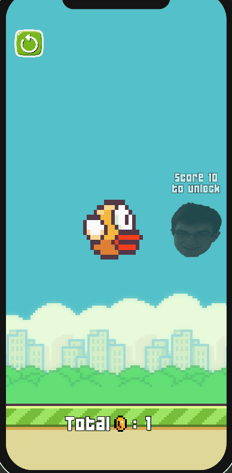
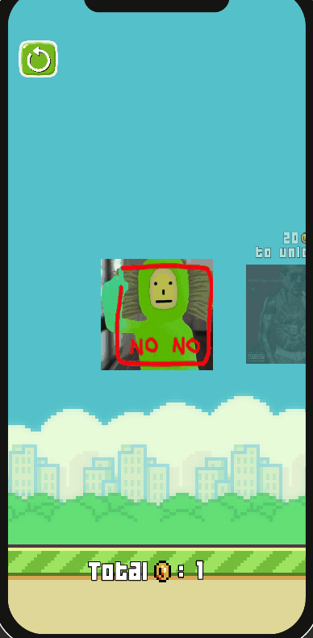
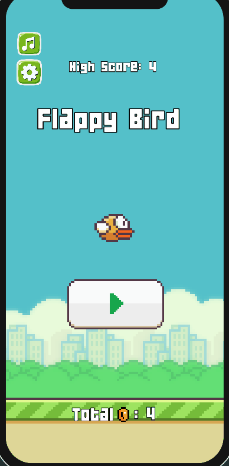

<h1 align="center">Flappy Bird Clone 🎮</h1>

 
  Welcome to my <strong>Flappy Bird Clone</strong>! This project was built using <strong>Unity</strong> and <strong>C#</strong> and aims to recreate the fun and challenging gameplay of the classic Flappy Bird.

  
   
  <em>The Game Menu</em>

<h2>📦 Features</h2>

<ul>
  <li><strong>Simple Tap-to-Fly Gameplay</strong>: Tap to control the bird’s flight and avoid pipes.</li>
  <li><strong>Score System</strong>: Earn points by successfully navigating through pipes.</li>
  <li><strong>Randomized Obstacles</strong>: Pipes appear at random heights to keep the game challenging.</li>
  <li><strong>2D Pixel Art</strong>: Inspired by retro pixel art style.</li>
  <li><strong>Custom Skins</strong>: Collect ingame coins and play as my friends!</li>
  <li><strong>Custom Music</strong>: Collect ingame coins and choose the music of the game!</li>
 

   <em> &nbsp;&nbsp;&nbsp; </em>
  
   
  <em>The Skins Selection Menu &nbsp;&nbsp;&nbsp;&nbsp;&nbsp;&nbsp;&nbsp; The Music Selection Menu</em>

</ul>

<h2>🎮 Gameplay</h2>

   
  <em>Random pipes and Random coins!</em>

